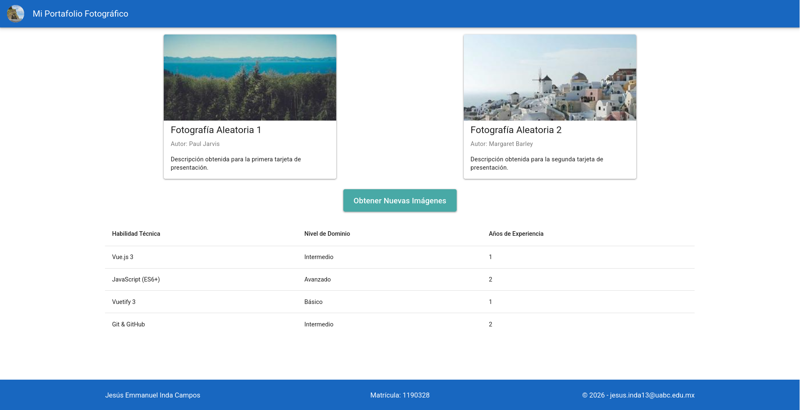
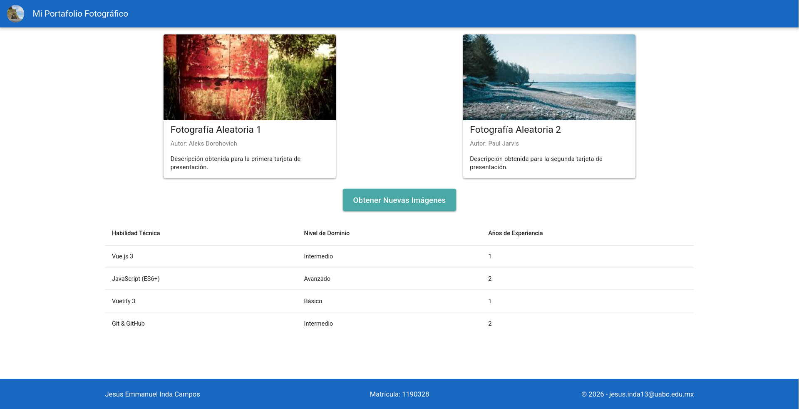

# Portafolio Fotográfico Dinámico

**Autor:** Jesús Emmanuel Inda Campos
**Matrícula:** 1190328
**Asignatura:** Desarrollo de Aplicaciones Web
**Programa:** Ingeniero en Computación

Aplicación web desarrollada con Vue 3 y Vuetify 3. Presenta una interfaz tipo portafolio que consume imágenes aleatorias desde la API de Picsum y permite actualizarlas dinámicamente, mostrando además los metadatos de cada fotografía.

## Captura de Pantalla

## Tecnologías Utilizadas

* **Vue 3** (Composition API)
* **Vuetify 3**
* **Vite**
* **Fetch API**
* **Git y GitHub**

## Instrucciones de Instalación y Ejecución

1. Clonar el repositorio:
    
        git clone https://github.com/EmmanuelInda/Meta-2.2---Interfaz-de-usuario-con-Vuetify.git

2. Navegar al directorio del proyecto:

        cd proyecto-vue-vuetify

3. Instalar las dependencias:

        npm install

4. Ejecutar el servidor de desarrollo local:

        npm run dev

## Estructura del Proyecto

    proyecto-vue-vuetify/
    ├── src/
    │   ├── components/
    │   │   ├── AppHeader.vue
    │   │   ├── AppFooter.vue
    │   │   ├── TarjetaConImagen.vue
    │   │   └── TablaDeDatos.vue
    │   ├── App.vue
    │   └── main.js

## Funcionamiento de la Integración con la API

La aplicación se conecta a la API de **Picsum** a través de su endpoint de lista de imágenes (https://picsum.photos/v2/list?page=1&limit=50). 

La lógica implementada realiza lo siguiente:
1. Al montar el componente o al presionar el botón de actualización, se activa un estado de carga.
2. Se realiza una petición asíncrona a la API.
3. Se seleccionan dos índices aleatorios diferentes del arreglo de respuesta JSON.
4. Se construyen las URLs específicas para las imágenes seleccionadas utilizando sus respectivos IDs.
5. Se extrae el nombre del autor original y se actualiza el estado reactivo de las tarjetas.
6. Se manejan los posibles errores de red mostrándolos en un componente de alerta visual.